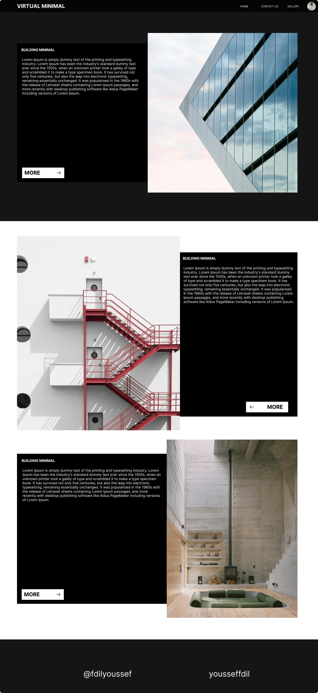

<h1>DESCRIPTION</h1>
This is a real estate website where you can browse and buy homes, condos, and apartments in different cities across the country. The website offers a user-friendly interface where you can search for properties by city, price, and number of bedrooms and bathrooms. You can view property details, save favorite properties, and contact the real estate agent for more information. The website is built using HTML, CSS, and JavaScript and is licensed under the MIT License.

